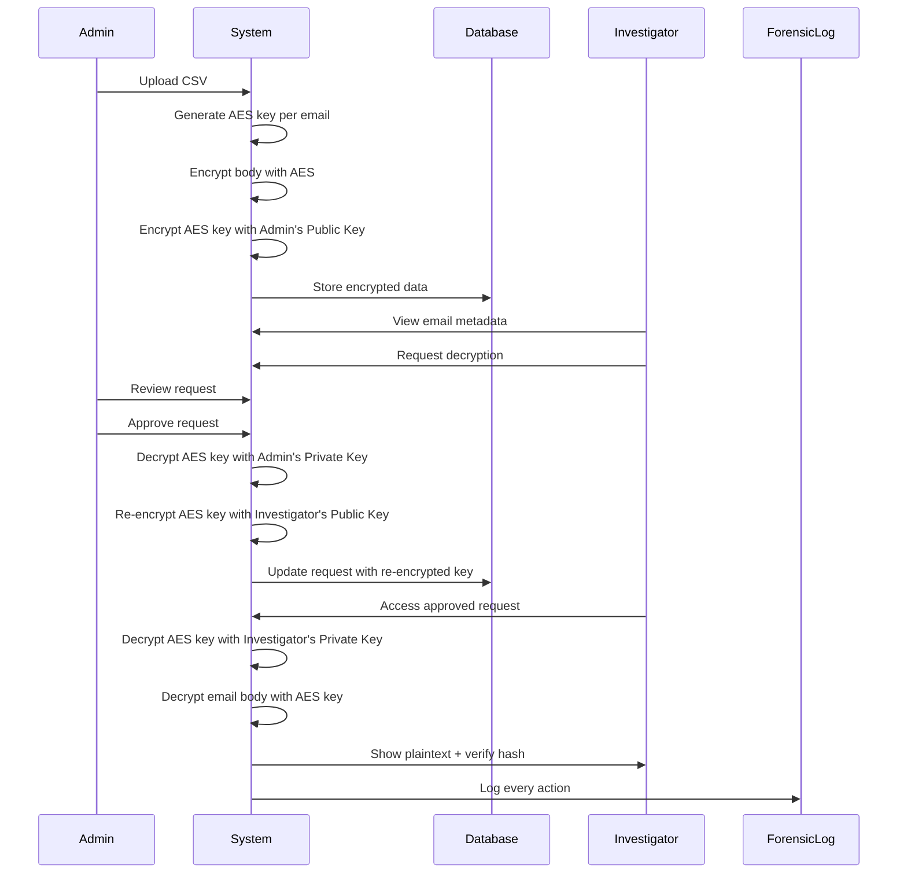

# 🚀 Setup Instructions - P2DF Email Forensic System

## Bước 1: Cài đặt Dependencies

```bash
composer install
```

## Bước 2: Tạo file .env

Tạo file `.env` với nội dung:

```env
APP_NAME="P2DF Email Forensic"
APP_ENV=local
APP_KEY=
APP_DEBUG=true
APP_URL=http://localhost

LOG_CHANNEL=stack
LOG_DEPRECATIONS_CHANNEL=null
LOG_LEVEL=debug

DB_CONNECTION=mysql
DB_HOST=127.0.0.1
DB_PORT=3306
DB_DATABASE=email_forensic
DB_USERNAME=root
DB_PASSWORD=your_mysql_password

BROADCAST_DRIVER=log
CACHE_DRIVER=file
FILESYSTEM_DISK=local
QUEUE_CONNECTION=sync
SESSION_DRIVER=file
SESSION_LIFETIME=120

MEMCACHED_HOST=127.0.0.1

REDIS_HOST=127.0.0.1
REDIS_PASSWORD=null
REDIS_PORT=6379

MAIL_MAILER=smtp
MAIL_HOST=mailpit
MAIL_PORT=1025
MAIL_USERNAME=null
MAIL_PASSWORD=null
MAIL_ENCRYPTION=null
MAIL_FROM_ADDRESS="hello@example.com"
MAIL_FROM_NAME="${APP_NAME}"
```

## Bước 3: Generate Application Key

```bash
php artisan key:generate
```

## Bước 4: Tạo Database

Trong MySQL command line hoặc phpMyAdmin:

```sql
CREATE DATABASE email_forensic CHARACTER SET utf8mb4 COLLATE utf8mb4_unicode_ci;
```

## Bước 5: Chạy Migrations và Seeders

```bash
php artisan migrate --seed
```

**Output sẽ hiển thị:**
```
====================================
  P2DF Email Forensic System Seed
====================================

Creating Admin user...
✓ Admin created: admin@example.com / password
  Public key: /keys/admin_public.pem
  Private key: /keys/admin_private.pem

Creating Investigator 1...
✓ Investigator 1 created: inv1@example.com / password
  Public key: /keys/investigator1_public.pem
  Private key: /keys/investigator1_private.pem

Creating Investigator 2...
✓ Investigator 2 created: inv2@example.com / password
  Public key: /keys/investigator2_public.pem
  Private key: /keys/investigator2_private.pem

Creating sample emails...
✓ Email #1 created: Quarterly Report Review
✓ Email #2 created: Project Alpha - Security Concerns
✓ Email #3 created: Confidential: Merger Discussion
✓ Email #4 created: Team Update - New Funding Round
✓ Email #5 created: Suspicious Transaction Alert

====================================
  Database seeding completed!
====================================

Login credentials:
  Admin: admin@example.com / password
  Investigator 1: inv1@example.com / password
  Investigator 2: inv2@example.com / password
```

## Bước 6: Khởi động Server

```bash
php artisan serve
```

Server sẽ chạy tại: **http://localhost:8000**

## Bước 7: Test Hệ Thống

### Test 1: Login as Admin
1. Truy cập: `http://localhost:8000`
2. Login với: `admin@example.com` / `password`
3. Xem dashboard → 5 emails đã được mã hóa

### Test 2: Upload Email Dataset
1. Login as Admin
2. Navigate to: **Upload**
3. Upload file: `sample_emails.csv`
4. Kiểm tra emails đã được mã hóa thành công

### Test 3: Investigator Request Decryption
1. Logout và login lại với: `inv1@example.com` / `password`
2. Navigate to: **Emails**
3. Chọn một email → Click **View**
4. Click **Submit Request** với lý do giải mã
5. Kiểm tra status = "Pending"

### Test 4: Admin Approve Request
1. Logout và login lại với: `admin@example.com` / `password`
2. Navigate to: **Requests**
3. Chọn request pending → Click **Approve**
4. Kiểm tra status = "Approved"

### Test 5: Investigator Decrypt Email
1. Logout và login lại với: `inv1@example.com` / `password`
2. Navigate to: **My Requests**
3. Chọn request approved → Click **Decrypt**
4. Xem plaintext content đã được giải mã
5. Kiểm tra hash verification = "OK"

### Test 6: View Forensic Logs
1. Login as Admin
2. Navigate to: **Logs**
3. Kiểm tra tất cả actions đã được log:
   - login
   - upload_email
   - request_decrypt
   - approve_request
   - decrypt_email

## 🔍 Kiểm tra Keys

RSA keys được sinh tự động trong thư mục:
```
storage/keys/
├── admin_public.pem
├── admin_private.pem
├── investigator1_public.pem
├── investigator1_private.pem
├── investigator2_public.pem
└── investigator2_private.pem
```

## 📊 Database Structure

Kiểm tra database sau khi migrate:

```sql
-- Xem users
SELECT id, name, email, role FROM users;

-- Xem encrypted emails
SELECT id, `from`, `to`, subject, 
       LEFT(body_encrypted, 50) as encrypted_preview 
FROM emails;

-- Xem decryption requests
SELECT dr.id, e.subject, u.name as investigator, 
       dr.status, dr.created_at
FROM decryption_requests dr
JOIN emails e ON dr.email_id = e.id
JOIN users u ON dr.investigator_id = u.id;

-- Xem logs
SELECT fl.id, u.name, fl.role, fl.action, 
       fl.target_id, fl.created_at
FROM forensic_logs fl
JOIN users u ON fl.user_id = u.id
ORDER BY fl.created_at DESC
LIMIT 20;
```

## 🔧 Troubleshooting

### Problem: "Class 'CryptoService' not found"
**Solution:**
```bash
composer dump-autoload
php artisan optimize:clear
```

### Problem: "SQLSTATE[HY000] [1045] Access denied"
**Solution:** Kiểm tra lại MySQL credentials trong `.env`:
```env
DB_USERNAME=root
DB_PASSWORD=your_correct_password
```

### Problem: "Admin public key not found"
**Solution:** Chạy lại migrations và seeders:
```bash
php artisan migrate:fresh --seed
```

### Problem: Upload file không hoạt động
**Solution:** Kiểm tra quyền thư mục storage:
```bash
# Linux/Mac
chmod -R 775 storage
chmod -R 775 bootstrap/cache

# Windows (Run as Administrator)
icacls storage /grant Users:F /T
```

### Problem: "419 Page Expired" khi submit form
**Solution:** Clear cache và cookies browser, hoặc:
```bash
php artisan config:clear
php artisan cache:clear
```

## 📝 Sample CSV Format

File `sample_emails.csv` có format:
```csv
from,to,subject,body
sender@example.com,recipient@example.com,Email Subject,"Email body content can be multi-line"
```

**Lưu ý:**
- Header row là bắt buộc: `from,to,subject,body`
- Body có thể chứa newlines (dùng quotes)
- Max file size: 10MB
- Encoding: UTF-8

## 🎓 Understanding the Flow



## 🔐 Security Notes

1. **Private Keys**: Never expose private keys. They are stored in `storage/keys/` with 0600 permissions.
2. **Passwords**: All passwords are hashed using bcrypt.
3. **Sessions**: Sessions expire after 120 minutes.
4. **CSRF Protection**: All forms are protected with CSRF tokens.
5. **Audit Trail**: Every action is logged in `forensic_logs` table.

## ✅ Checklist

- [ ] Database created
- [ ] `.env` configured
- [ ] `php artisan key:generate` executed
- [ ] `php artisan migrate --seed` completed
- [ ] RSA keys generated in `storage/keys/`
- [ ] Can login as Admin
- [ ] Can login as Investigator
- [ ] Can upload emails
- [ ] Can request decryption
- [ ] Can approve requests
- [ ] Can decrypt emails
- [ ] Logs are being recorded

---

**🎉 If all tests pass, your P2DF Email Forensic System is ready!**

